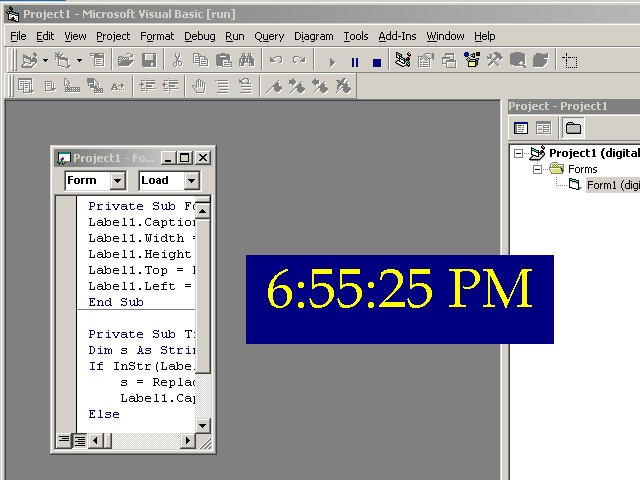



## A Beginners Digital Clock

### Description

Show A Simple Digital Clock. No Api or ocx. its very simple using label and timer
 
### More Info
 
no parameters

Using Commonly Used Controls like timer, label only

Shows a Digital Clock

No side Effects

             |
---                |---
**Submitted On**   |2005-12-12 08:40:14
**By**             |[Sridhar Madabhushi](https://github.com/Planet-Source-Code/PSCIndex/blob/master/ByAuthor/sridhar-madabhushi.md)
**Level**          |Beginner
**User Rating**    |4.7 (14 globes from 3 users)
**Compatibility**  |VB 5\.0, VB 6\.0
**Category**       |[Math/ Dates](https://github.com/Planet-Source-Code/PSCIndex/blob/master/ByCategory/math-dates__1-37.md)
**World**          |[Visual Basic](https://github.com/Planet-Source-Code/PSCIndex/blob/master/ByWorld/visual-basic.md)
**Archive File**   |[A\_Beginner19560612122005\.zip](https://github.com/Planet-Source-Code/sridhar-madabhushi-a-beginners-digital-clock__1-63625/archive/master.zip)

### API Declarations

no api declarations

